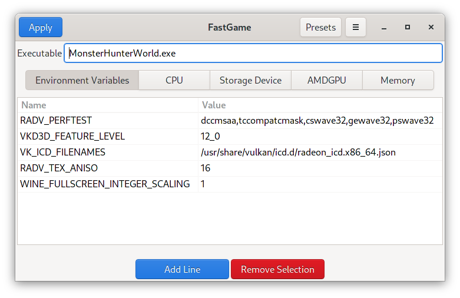
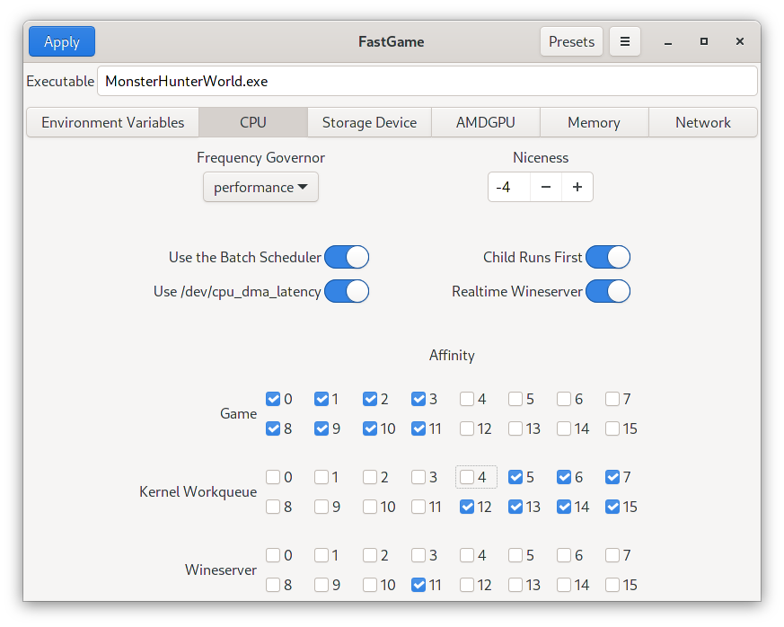
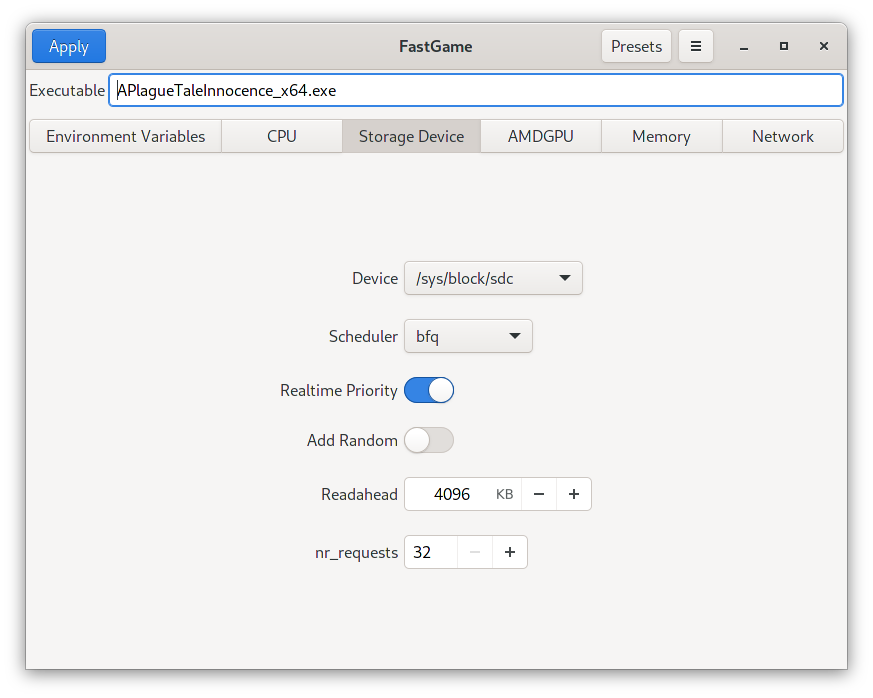

# FastGame

This is a project I started for fun and for learning purposes. It allows the user to apply small system configuration
tweaks that may increase gaming performance. The kernel Process Events Connector is used to monitor creation and
destruction of processes. When the kernel sends us the PID value of a recently created process we read the file
`/proc/PID/comm` and if the process name matches the game executable name provided in the user interface a few settings
are applied to the game process.





# Application usage

When the window is opened it will show the value of the system parameters. This is a good momento to open
our presets menu and saving the current settings in a profile named `default` or whatever name you prefer. This will
make it easier to recover your system default settings while doing tests.

Once you have configured the parameters click on the `Apply` button in the window top left corner. After a few seconds
an authentication window should be shown by your system. A few of the available settings can only be changed with root
access. After authentication the settings that can be immediately applied will be applied. And a server that listen
to the kernel Process Events Connector will be launched. this server applies to the game process settings like cpu
affinity, priority scheduler, etc. It will be automatically finished once the main window is closed. So keep FastGame
window open while playing!

If want to apply environment variables it is necessary to launch the game with `fastgame_launcher`. In Steam all that
you have to do is putting this `fastgame_launcher %command%` in the launch options.

# Features

- Set Environment variables like `RADV_PERFTEST`
- Easy cpu affinity configuration
- Change the cpu frequency governor
- Change the process niceness
- Use /dev/cpu_dma_latency to avoid deep C-States
- Apply the SCHED_BATCH priority scheduler to the game process
- Apply the SCHED_RR priority scheduler to the wineserver process
- Change the disk scheduler
- Change the readahead and nr_requests values
- Disable the disk `add_random`
- Apply the Realtime IO priority to the game process
- Set amdgpu performance level and power cap
- Configure the virtual memory cache pressure
- Configure the virtual memory compaction proactiveness
- Configuring transparent hugepages
- Saving all the settings above to a preset file that can be easily loaded

# Compilation

```
cd fastgame
meson build
cd build
ninja
```
